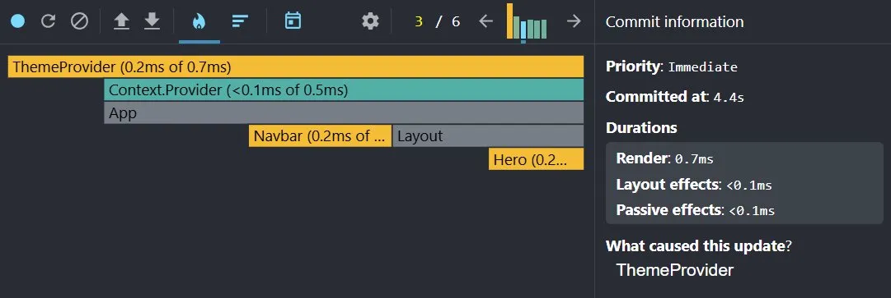
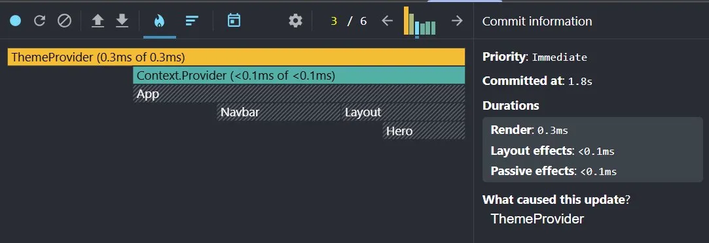
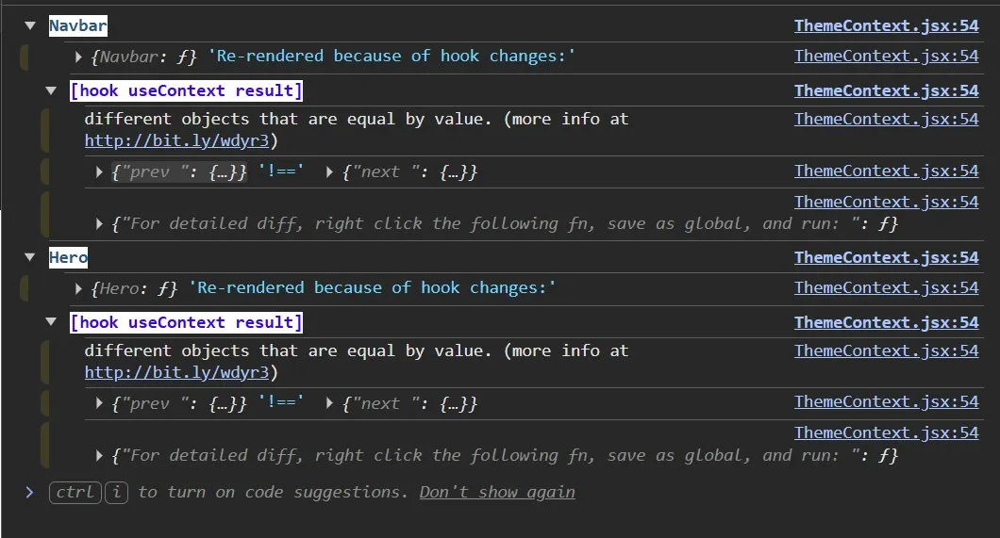

# Context API and Custom Hooks - Theme Demo

This branch introduces performance optimisation for context - specifically preventing unnecessary re-renders in context consumers.

## The problem

Every time `ThemeProvider` re-renders, the `value` object is recreated:

```js
const value = {
  theme,
  toggleTheme
}
```

Even if `theme` and `toggleTheme` have not changed, this is a brand new object in memory. React sees a new object and tells every component consuming the context to re-render - whether or not anything they care about actually changed.

To see this in action, click the "Provider re-render" button in the app. This increments a counter inside `ThemeProvider` that has nothing to do with theme. Open the React DevTools Profiler, hit record, click the button a few times, then stop.



What caused this update: `ThemeProvider`. Theme did not change. Yet Navbar and Hero re-rendered anyway - because the `value` object looked new to React. Every component that calls `useTheme()` is subscribed to that value, so when React sees a new object, all of them update.

## useMemo

You have seen `useMemo` before. It memoises a value - React only recomputes it when its dependencies change.

```js
const value = useMemo(() => ({
  theme,
  toggleTheme
}), [theme, toggleTheme])
```

The dependency array `[theme, toggleTheme]` tells React: only recreate this object when one of these actually changes. If neither has changed, return the same object as last time - and skip re-rendering the consumers.

This solves the object recreation problem, but it introduces a new one.

## useCallback

Look at the dependency array again: `[theme, toggleTheme]`. React watches both. If either changes, the memoised value is thrown away and recreated.

The problem is `toggleTheme`. Without any memoisation, it is a regular function defined inside `ThemeProvider`:

```js
const toggleTheme = () => {
  setTheme(prev => prev === 'light' ? 'dark' : 'light')
}
```

Every render creates a new function in memory. It does the same thing as before, but React does not know that - it just sees a different reference. So as far as `useMemo` is concerned, `toggleTheme` changed, the dependency array fired, and the value object was recreated anyway. The memoisation achieved nothing.

`useCallback` solves this. It is the function equivalent of `useMemo` - under the hood they are identical. `useCallback(fn, deps)` is the same as `useMemo(() => fn, deps)`. React provides it as a convenience because memoising functions is so common.

```js
const toggleTheme = useCallback(() => {
  setTheme(prev => prev === 'light' ? 'dark' : 'light')
}, [])
```

The empty array `[]` means: never recreate this function after the first render. This is safe here because `toggleTheme` does not depend on any external variable - it only uses the state setter, which React guarantees is always stable.

## Why they need each other

`useMemo` and `useCallback` only work here because they are used together.

Without `useCallback`, `toggleTheme` is a new function every render. `useMemo` sees it as a changed dependency and fires. Nothing is saved.

Without `useMemo`, the value object is recreated every render regardless. `useCallback` stabilises the function but there is nothing to benefit from that stability.

When both are in place, `useCallback` keeps `toggleTheme` stable. `useMemo` sees that neither `theme` nor `toggleTheme` has changed, returns the same object, and consumers are skipped entirely.

## Try it yourself

The file has commented out versions of both. Swap them in one at a time and watch the profiler.

Remove `useCallback` first - keep `useMemo` in place. Click the counter. The consumers will re-render again because `toggleTheme` is unstable and `useMemo` keeps firing.

Then remove `useMemo` as well. Click the counter. Same result - everything re-renders on every click (seen in the first screenshot).

Then restore both. Click the counter. Only `ThemeProvider` re-renders.



App, Navbar, Layout and Hero are all grey. React looked at each one, saw nothing had changed, and skipped them entirely.

## Spotting wasteful re-renders

The profiler is a powerful tool but it has a limitation - it shows you everything that re-rendered, including re-renders that were completely intentional. When you toggle the theme, Navbar and Hero should re-render. 

When you click the counter, they should not. In a small app you can tell the difference by eye. In a larger app with many components and many state changes happening at once, identifying which re-renders were wasteful and which were necessary becomes genuinely difficult.

`@welldone-software/why-did-you-render` solves that. It watches the components you tell it to watch and logs to the console when they re-render unnecessarily - specifically when the previous and next values are equal but React re-rendered anyway. It does not log intentional re-renders. It only speaks up when work was done for no reason.

**Setup**

Install it as a dev dependency:

```bash
npm install @welldone-software/why-did-you-render --save-dev
```

Create `src/wdyr.js`:

```js
import React from 'react'
import whyDidYouRender from '@welldone-software/why-did-you-render'

whyDidYouRender(React, {
  trackAllPureComponents: false
})
```

Import it at the very top of `main.jsx`. This must be the first import in the file - if anything else loads before it, the tool will not work correctly:

```js
import './wdyr.js'
import { StrictMode } from 'react'
// rest of imports
```

Then opt any component into tracking by adding one line after the function definition and before the export:

```js
function Navbar() {
  // ...
}

Navbar.whyDidYouRender = true

export default Navbar
```

```js
function Hero() {
  // ...
}

Hero.whyDidYouRender = true

export default Hero
```

**What you will see**

Remove `useMemo` and `useCallback`, open the console, and click the counter button. You should see messages like this:



The key phrase is **"different objects that are equal by value"**. The previous and next context values contain identical data - theme has not changed, toggleTheme does the same thing - but they are different objects in memory. React compares by reference, not by value. It sees something new and re-renders.

Now restore `useMemo` and `useCallback` and click the counter again. The messages stop. The re-renders that were happening for no reason no longer happen.

This is the workflow the tool is designed for: identify a component that feels slow or re-renders too often, add `whyDidYouRender = true`, and let the console tell you exactly what is changing and why. From there you know precisely where to reach for `useMemo`, `useCallback`, or `memo()`.

## A note on scale

In this app the difference is measured in fractions of a millisecond. The app is small and the renders are cheap. This optimisation matters when the component tree is large, consumers are expensive to render, or the Provider re-renders frequently for unrelated reasons. The pattern is worth knowing - you will reach for it when you feel the problem in a real app.

## These tools are not context-specific

The React DevTools Profiler and `why-did-you-render` are not tools for debugging context api. They are general purpose performance tools that work across your entire React application. We introduced them here because context made the problem visible in a clear and contained way - but you can use them anywhere.

Any component that re-renders too often, any value that gets recomputed unnecessarily, any function that loses its reference between renders - these tools will help you find and fix those problems regardless of whether context api is involved. 

**The workflow is the same**: spot the unnecessary work, identify what is changing, reach for the right tool to stabilise it.